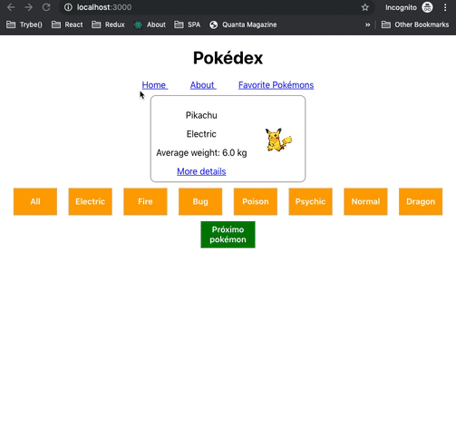

Esse é um projeto para o conteúdo de `React Router Dom`.

### Antes de iniciar

Crie um fork desse projeto e para isso siga esse [tutorial de como realizar um fork](https://guides.github.com/activities/forking/).

Após feito o fork, clone o repositório criado para o seu computador.

Rode o `npm install`.

Vá para a branch master do seu projeto e execute o comando:

git branch

Mude para a branch pokedex-router com o comando git checkout -b pokedex-router. É nessa branch que você realizará a solução para o exercício.

Observe o que deve ser feito nas instruções.

Após a solução dos exercícios, abra um PR no seu repositório forkado e, se quiser, mergeie para a master, sinta-se a vontade!

**Atenção!** Quando for criar o PR você irá se deparar com essa tela:

É necessário realizar uma mudança. Clique no *base repository* como na imagem abaixo:

Mude para o seu repositório. Seu nome estará na frente do nome dele, por exemplo: `antonio/pokedex-router`. Depois desse passo a página deve ficar assim:

Agora basta criar o PULL REQUEST clicando no botão `Create Pull Request`.

Para cada PR realize esse processo.

### COMEÇANDO OS EXERCÍCIOS

Hoje você vai incrementar a sua Pokedex utilizando Router. Caso você queira reutilizar a sua Pokedex de exercícios anteriores, basta substituir a pasta src desse repositório pela src da sua pokedex já pronta, após seguir os passos de `Antes de iniciar`.

Se você não tiver feito, sem problemas, aqui você ja vai encontrar o comportamento esperado da sua Pokedex após os últimos exercícios.

Nesse repositório ja foi instalado o `react-router-dom`, só é necessário executar `npm install` uma vez dentro da pasta raiz para utilizá-lo.

#### Exercício 1

Ao carregar a aplicação no caminho de _URL_ "/", é preciso que seja mostrada a Pokédex.

#### Exercício 2

Adicione um link de navegação para o pokémon sendo mostrado pela Pokédex, de forma que quem usar a aplicação consiga clicar no link para ver mais detalhes do pokémon em questão. O nome do caminho da _URL_ fica a seu critério. Lembre-se de que é preciso passar para a _URL_ um identificador do pokémon, de forma que cada pokémon seja unicamente associado com o caminho de _URL_. Ou seja, se você quer que os detalhes de um pokémon se encontrem no caminho de _URL_ `/pokemons`, você precisa passar para esse caminho um parâmetro de _URL_ para que somente um pokémon seja visualizado. Todo pokémon tem um `id` na Pokédex, logo você poderia usá-lo como parâmetro de _URL_ para permitir que quem usar sua aplicação consiga acessar detalhes do pokémon `Pikachu` via caminho de _URL_ `/pokemons/25`, onde `25` é o `id` do `Pikachu`. 🙂

#### Exercício 3

Crie um componente `PokemonDetails` para ser usado na visualização de mais detalhes do pokémon no passo anterior. É preciso que sejam mostradas as seguintes informações:
  * Nome do pokémon;

  * Tipo do pokémon;

  * Peso do pokémon, com sua devida medida de peso;

  * Sumário informativo a respeito do pokémon;

  * Mapa(s) que mostra(m) as possíveis localizações do pokémon.

#### Exercício 4

Adicione um conjunto *fixo* de links de navegação no topo de sua aplicação, de forma que ele esteja *sempre* disponível para quem fizer uso. De início, adicione um link que leve quem usa sua aplicação de volta para a Pokédex.

#### Exercício 5

Crie um componente `About` para ser usado na visualização que explica brevemente o que é uma Pokédex, com alguma imagem ilustrativa. Use esta [página](https://bulbapedia.bulbagarden.net/wiki/Pok%C3%A9dex) como inspiração. 🙂

#### Exercício 6

Adicione no conjunto *fixo* de links de navegação um link que permita levar quem usa sua aplicação para a visualização de explicação da Pokédex.

#### Exercício 7

Crie um componente `NotFound`, de forma que *somente* ele seja renderizado caso o caminho atual da _URL_ da aplicação não corresponda a rota alguma definida anteriormente. 

Segue uma sugestão de implementação da aplicação, que se baseia na solução da Pokédex com estado que você precisou fazer anteriormente, com todos os requisitos bônus feitos. Nessa sugestão *não* estão implementados os requisitos bônus referentes ao exercício de hoje; eles ficarão a cargo da sua imaginação para implementá-los:

### Bônus

Agora que você tem uma aplicação Pokédex navegável, que tal encarar estes bônus? 👀

* Permita que um pokémon consiga ser favoritado dentro de sua visualização de mais detalhes. Uma vez favoritado, adicione algum indicativo visual, de forma que quem vir o pokémon saiba que ele foi favoritado. O indicativo de que o pokémon foi favoritado precisa também aparecer na página principal, que mostra a Pokédex;

* Crie uma visualização que mostre somente os pokémons favoritados e torne-a acessível para quem a usar, criando um link para ela no conjunto **fixo** de links que você fez anteriormente;

* Salve os pokémons favoritados no local storage e recupere-os quando a aplicação for inicializada.
